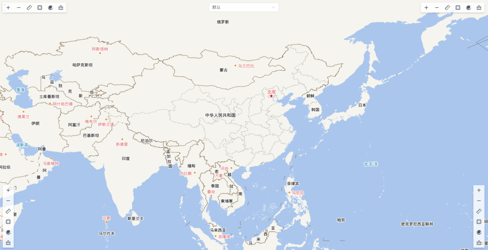
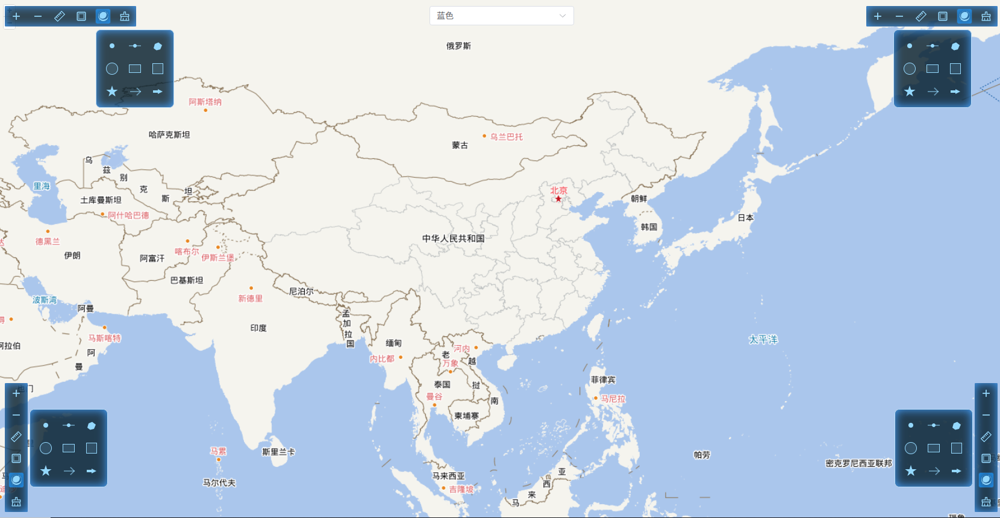

# Vue3 OpenLayers Styled Controls

A customizable styled controls library for maps based on vue3-openlayers.

## Overview

Vue3 OpenLayers Styled Controls is a lightweight component library focused on providing beautiful, responsive control bars and tool buttons for web map applications. It addresses the limitations of native OpenLayers controls by offering themeable styles and easy integration with modern UI frameworks.

## Languages

- [English](./README_en.md)
- [中文 (Chinese)](./README.md)

## screenshot




## Features

- 🎨 Built with Vue 3 Composition API and `<script setup>` syntax
- 🌍 Internationalization (i18n) support
- 🎨 Themeable styles via SCSS variables
- 📦 Lightweight and focused on core functionality
- 🛠️ Full TypeScript type support
- 📱 Responsive design, mobile-friendly

## Supported Controls

- `OlStyledControlBar`: control container
- `OlStyledZoomInControl`: zoom in control
- `OlStyledZoomOutControl`: zoom out control
- `OlStyledFullScreenControl`: fullscreen control
- `OlStyledMeasureLengthControl`: measure length control
- `OlStyledMeasureAreaControl`: measure area control
- `OlStyledClearControl`: clear control
- `OlStyledSwipeControl`: swipe (compare) control
- `OlStyledBaseLayerSwitcher`: base layer switcher

## 安装

```bash
npm install vue3-openlayers-styled-controls
```

## 基本使用

```vue
<template>
  <ol-map>
    <ol-view
      ref="view"
      :center="[120, 40]"
      :zoom="8"
      :projection="'EPSG:4326'"
    />

    <base-layer />

    <!-- use control bar and zoom controls -->
    <OlStyledControlBar>
      <OlStyledZoomInControl />
      <OlStyledZoomOutControl />
    </OlStyledControlBar>
  </ol-map>
</template>

<script setup>
import { ref } from 'vue'
import BaseLayer from './components/base-layer.vue'
// import control components
import {
  OlStyledControlBar,
  OlStyledZoomInControl,
  OlStyledZoomOutControl
} from 'vue3-openlayers-styled-controls'
</script>
```

## Internationalization (i18n)

The library includes built-in internationalization support and ships with default translations for Chinese and English.

### Default Languages

- Simplified Chinese (zh-CN)
- English (en)

### Set Default Language

You can set the default language when installing the plugin:

```js
import { createApp } from 'vue'
import App from './App.vue'
import OpenLayersControls from 'vue3-openlayers-styled-controls'

const app = createApp(App)

// Set default language to English
app.use(OpenLayersControls, {
  locale: 'en'
})

app.mount('#app')
```

### Custom Language Resources

If you need to add or customize language resources:

```js
import { createApp } from 'vue'
import App from './App.vue'
import OpenLayersControls from 'vue3-openlayers-styled-controls'

const app = createApp(App)

// Register custom language (example: French)
app.use(OpenLayersControls, {
  locale: 'fr', // default to French
  messages: {
    fr: {
      zoomIn: { title: 'Zoom avant' },
      zoomOut: { title: 'Zoom arrière' },
      fullScreen: { enter: 'Plein écran', exit: 'Quitter le plein écran' },
      measureLength: {
        title: 'Mesurer la distance',
        stop: 'Arrêter la mesure',
        startHelp: 'Cliquez pour commencer à dessiner',
        continueHelp: 'Cliquez pour continuer à dessiner la ligne'
      },
      measureArea: {
        title: 'Mesurer la surface',
        stop: 'Arrêter la mesure',
        startHelp: 'Cliquez pour commencer à dessiner',
        continueHelp: 'Cliquez pour continuer à dessiner le polygone',
        squareMeters: 'mètres carrés',
        squareKilometers: 'kilomètres carrés'
      },
      clear: { title: 'Effacer' },
      swipe: { title: 'Balayage' },
      baseLayerSwitcher: {
        title: 'Changer de fond de carte',
        noPreview: "Pas d'aperçu",
        unnamedLayer: 'Couche sans nom'
      }
    }
  }
})

app.mount('#app')
```

## Documentation

See the full documentation [address](./docs) or run the local documentation server:

```bash
npm run docs:dev
```

Or view the hosted docs: [address](https://dlinser.github.io/vue3-openlayers-styled-controls/)

## 开发

### Development

```bash
# after cloning the repo
cd vue3-openlayers-styled-controls

# install dependencies
npm install

# start dev server
npm run dev

# open http://localhost:5173
```

### Build

```bash
# build production bundle (output to dist/)
npm run build

# preview production build
npm run preview

# build docs
npm run docs:build

# preview docs
npm run docs:preview
```

## License

MIT
